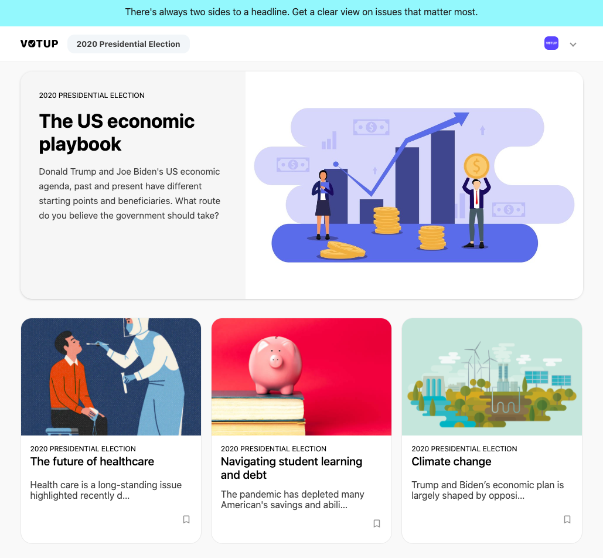
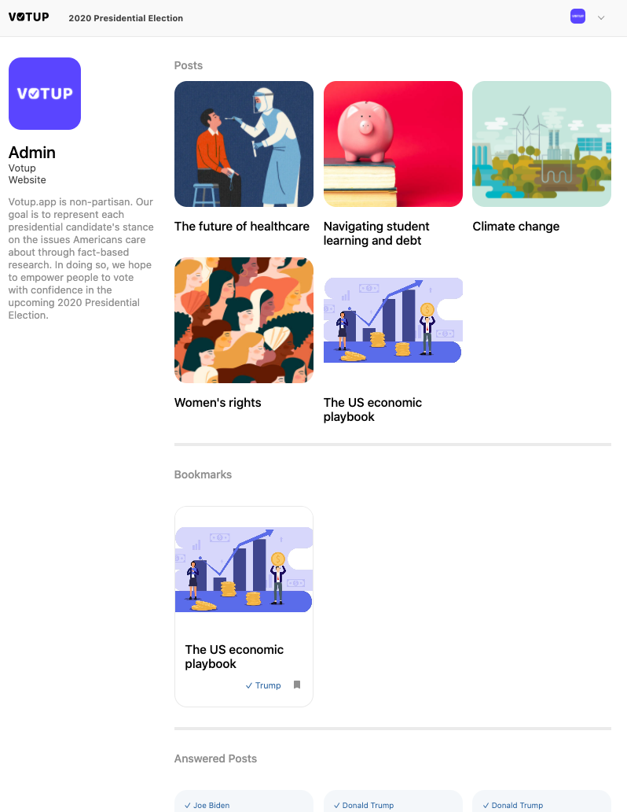
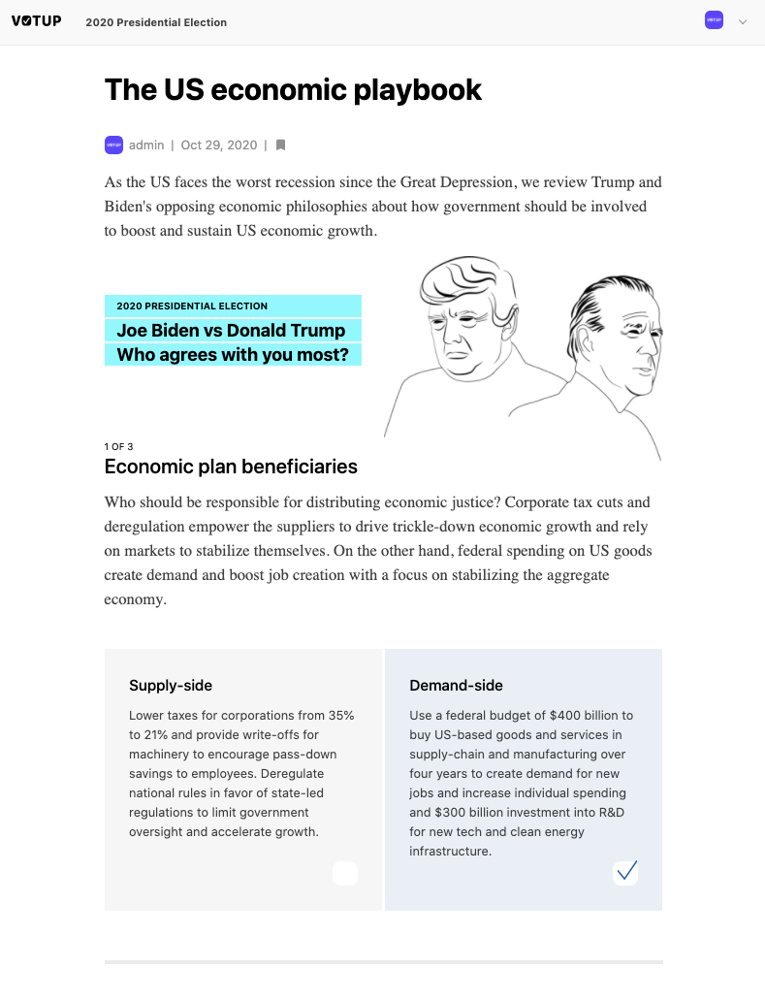
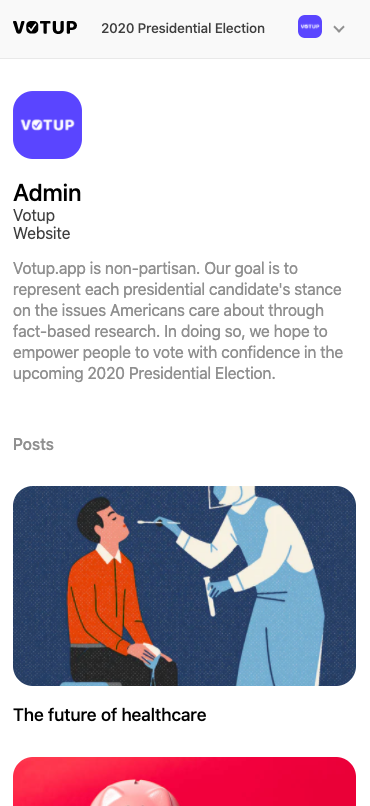
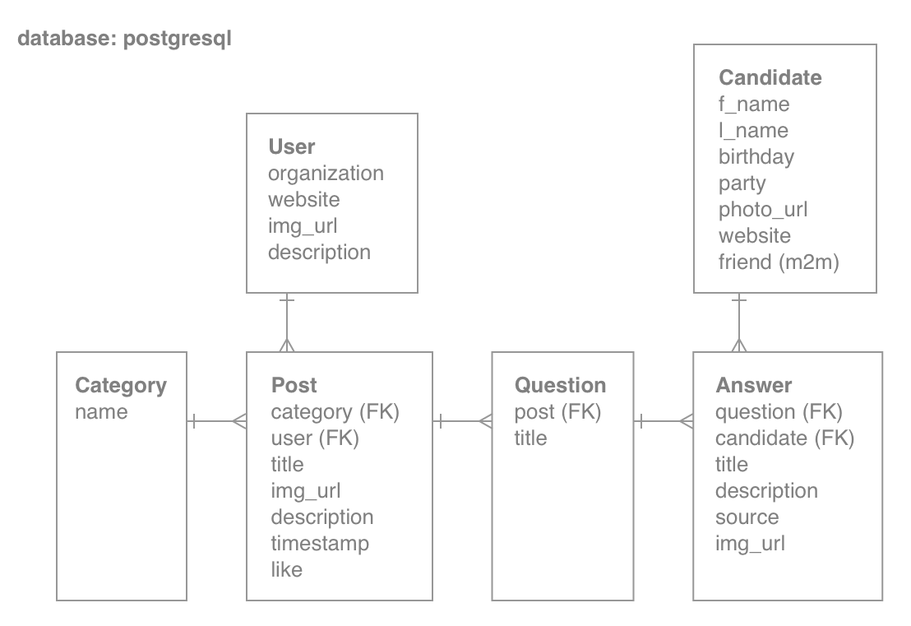

# CS50W Capstone

## Summary
Votup is a hybrid publication and quiz platform that lets users compare candidates up for election.

### Problem

Policies are complex and politics has become even more divisive accelerated by misinformation spread across social media. In fact, among non-voters, nearly 40% cite lack of understanding and apathy of campaign issues as a reason for not voting. Most organizations focus on the later stage of the voting pipeline and reliable media content is often hidden behind a paywall. 

### Project

Votup allows publishers to create quizzes and users to view a side-by-side comparison of candidate's views under popular topics, view summary of their quiz results per category and post. Users can also bookmark posts.

### Mobile-responsive design
<div style="display: grid; grid-template-columns: repeat(2, 1fr); grid-gap: 3px;">
  <div style="display:row;">
    
    
  </div>
  <div style="display:row;">
    
    
  </div>
</div>

<div style="display: grid; grid-template-columns: repeat(4, 1fr); grid-gap: 3px;">
    
    
    
    
</div>

---
## Final project requirements
- [x] distinct from past projects
- [x] utilize Django for back-end
- [x] utilize JavaScript for front-end
- [x] mobile-responsive
- [x] readme.md describe project
  - [x] what's contained in each file
---
## Project file structure

__votup project/__: main project folder
- __media/posts__: user uploaded files
- __posts__: posts app folder
  - __migrations__: track all migrations
  - __static__
    - __css__: main css file
    - __images/posts__: svg images
    - __js__: javascript files (index.js, post.js)
    - __scss__: scss files (_components.scss, _mixins.scss, _reset.scss, _variables.scss, main.scss)
  - __templates/posts__: html files (base.html, index.html, login.html, register.html, post.html, profile.html)
  - __tests__: test files
    - __init__.py
    - __test_models.py__: tests for models
    - __test_views.py__: test for
  - __init__.py
  - __admin.py__: admin classes
  - __apps.py__
  - __models.py__: seven models for posts app
  - __urls.py__: pages(index, post, profile, login, register) and fetch api
  - __views.py__: logic for all pages and fetch api
- __.env__: environment variables
- __manage.py__
- __Pipfile__: manage project dependencies
- __Pipfile.lock__: list of dependencies
- __readme.md__: project spec documentation

---
## Database schema 



## Installation guide
```terminal
# clone git repository
$ git clone <git repository>

# go into project root
$ cd votup project

# install dependency manager
$ pip install pipenv

# create virtual environment
$ pipenv shell

# install project dependencies in Pipfile
# pipenv install <dependency_name>
```

## Usage
- Admin can create posts and quizzes
- Users can take quizzes, review quiz results, and bookmark posts